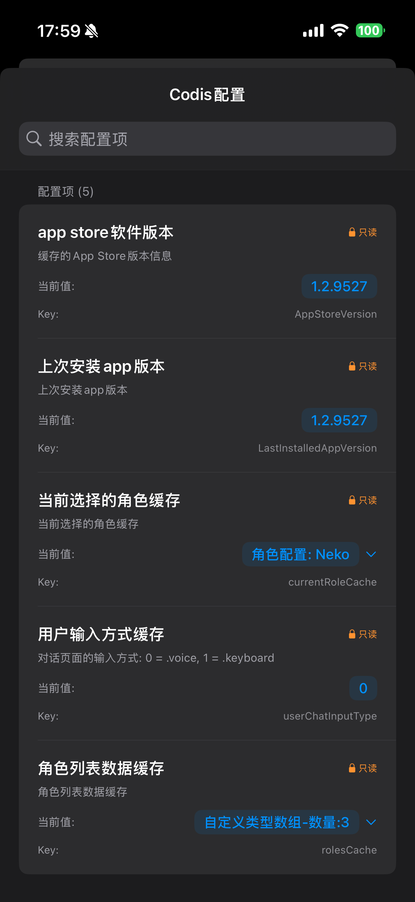

# Codis

一个基于 Swift 的 iOS 本地配置管理框架，提供类型安全、响应式的配置管理解决方案。

## 功能特性

- **类型安全**: 使用 Swift 泛型和协议确保配置项的类型安全
- **响应式编程**: 基于 Combine 框架，支持配置变化的实时监听
- **线程安全**: 使用 NSLock 确保多线程环境下的安全访问
- **属性包装器**: 通过统一的 `@Codis` 提供简洁的配置访问语法
- **持久化存储**: 基于 UserDefaults 实现配置的本地持久化
- **协议化设计**: 使用协议定义配置项，提高代码的可扩展性和可维护性
- **自定义类型支持**: 支持复杂数据结构的配置存储，包括自定义类型和数组
- **自动序列化**: 自定义类型自动进行JSON序列化和反序列化
- **智能类型识别**: 统一接口自动处理基础类型、自定义类型、数组和可选类型
- **nil值安全处理**: 正确识别和处理可选类型的nil值，支持无默认值配置
- **写入性能优化**: 改进的可选类型处理和无默认值情况下的优化逻辑

## 版本要求说明

- **Codis 核心库**: iOS 13.0+ (基于 Combine 框架)
- **CodisView**: iOS 15.0+ (使用了 `.searchable` 和 `.textSelection` 等 SwiftUI API)

## 项目结构

```
codis/
├── Core/                          # 核心框架代码
│   ├── Protocols/                 # 协议定义层
│   │   ├── CodisKeyProtocol.swift     # 配置键协议定义
│   │   ├── CodisBasicLimit.swift      # 基础类型协议
│   │   ├── CodisLimit.swift           # 自定义类型协议（CodisBasicLimit + Codable）
│   │   └── CodisCombineValue.swift    # Combine值包装器（解决nil值回调）
│   ├── Manager/                   # 核心管理器
│   │   └── CodisManager.swift     # 配置管理器（核心类）
│   ├── PropertyWrapper/           # 属性包装器
│   │   └── Codis.swift           # @Codis 统一包装器（支持基础类型、自定义类型、数组）
│   └── Views/                     # 视图组件
│       └── CodisView.swift       # 配置管理视图
├── CodisKey.swift                 # 配置键枚举定义（示例实现）
├── AppDelegate.swift             # 应用委托
├── SceneDelegate.swift           # 场景委托
└── ViewController.swift          # 主控制器
```

## 核心组件

### 1. CodisManager
配置管理的核心类，提供以下功能：
- 配置的读取和写入
- 基于 UserDefaults 的持久化存储
- Combine 响应式支持
- 线程安全的配置操作
- 配置键类型注册和管理

位于 `Manager/` 目录，是框架的核心功能实现。

```swift
// 注册配置键类型（必需步骤）
func addKeyType(type: CodisKeyProtocol.Type)

// 通过字符串 key 查找配置键实例
func findKey(for keyString: String) -> CodisKeyProtocol?
```

### 2. 属性包装器
提供统一的 `@Codis` 属性包装器，智能支持所有类型配置的简洁访问：

#### @Codis - 统一配置包装器
智能识别并处理各种数据类型：
```swift
// 基础数据类型（String, Int, Bool, Array, Dictionary等）
@Codis(key: CodisKey.userChatInputType)
var chatInputType: Int

// 自定义类型（自动JSON序列化）
@Codis(key: AppConfigKey.userSettings)
var userSettings: UserSettings?

// 自定义类型数组（自动JSON序列化）
@Codis(key: AppConfigKey.recentUsers)
var recentUsers: [UserInfo]

// 可选类型（正确处理nil值）
@Codis(key: AppConfigKey.optionalConfig)
var optionalConfig: String?
```

**智能类型处理机制：**
- **基础类型**：直接存储到UserDefaults
- **自定义类型**：自动进行JSON编码/解码
- **数组类型**：支持基础类型和自定义类型数组
- **可选类型**：正确处理nil值，支持无默认值配置

### 3. CodisKeyProtocol 协议
配置键协议定义，任何遵循该协议的类型都可以作为配置键使用。项目中的 `CodisKey` 枚举只是实现示例，用于防止key字符串重复。

协议要求：
- `key`: 配置的字符串标识符
- `desc`: 配置描述信息，用于UI展示
- `detail`: 配置的详细说明
- `canEdit`: 是否可以在UI中编辑
- `dataType`: 数据类型（CodisBasicLimit.Type）
- `defaultValue`: 配置的默认值（可选值）
- `find(keyString:)`: 静态方法，根据字符串key查找配置键实例

位于 `Protocols/` 目录，是框架的规范层。

**设计特点**：
- 支持类型安全的配置键定义
- 通过 `dataType` 属性确保配置值的类型安全
- `defaultValue` 为可选值，允许配置项没有默认值
- 静态方法 `find(keyString:)` 支持运行时的配置键查找

## 使用示例

### 自定义配置键
你可以创建自己的配置键类型，只需遵循 `CodisKeyProtocol` 协议：

```swift
// 自定义配置键枚举（推荐方式 - 防止key重复）
enum AppConfigKey: String, CodisKeyProtocol {
    case themeMode = "app_theme_mode"
    case fontSize = "app_font_size"
    case enableNotification = "app_enable_notification"
    case userSettings = "app_user_settings"
    case recentUsers = "app_recent_users"
    case optionalConfig = "app_optional_config"

    var key: String { rawValue }

    var desc: String {
        switch self {
        case .themeMode: return "主题模式"
        case .fontSize: return "字体大小"
        case .enableNotification: return "启用通知"
        case .userSettings: return "用户设置"
        case .recentUsers: return "最近用户"
        case .optionalConfig: return "可选配置"
        }
    }

    var detail: String { desc }

    var canEdit: Bool { true }

    var dataType: CodisBasicLimit.Type {
        switch self {
        case .themeMode: return String.self
        case .fontSize: return Int.self
        case .enableNotification: return Bool.self
        case .userSettings: return UserSettings.self
        case .recentUsers: return [UserInfo].self
        case .optionalConfig: return String?.self
        }
    }

    var defaultValue: CodisBasicLimit? {
        switch self {
        case .themeMode: return "light"
        case .fontSize: return 16
        case .enableNotification: return true
        case .userSettings: return nil // 可以没有默认值
        case .recentUsers: return [UserInfo]() // 默认为空数组
        case .optionalConfig: return nil // 可选配置无默认值
        }
    }

    static func find(keyString: String) -> AppConfigKey? {
        return AppConfigKey(rawValue: keyString)
    }
}

// 使用统一的 @Codis 包装器
@Codis(key: AppConfigKey.themeMode)
var themeMode: String

@Codis(key: AppConfigKey.userSettings)
var userSettings: UserSettings?

@Codis(key: AppConfigKey.recentUsers)
var recentUsers: [UserInfo]

@Codis(key: AppConfigKey.optionalConfig)
var optionalConfig: String?
```

### 自定义类型配置支持
Codis 提供了完整的自定义类型配置支持，适用于复杂的数据结构：

#### 1. 定义自定义类型
```swift
// 自定义类型只需遵循 CodisLimit 协议（CodisBasicLimit + Codable）
struct UserSettings: CodisLimit {
    var userId: String
    var theme: String
    var notifications: Bool

    // 实现 CodisBasicLimit 协议
    var formatValue: String {
        return "用户设置: \(userId), 主题: \(theme)"
    }
}

struct UserInfo: CodisLimit {
    let id: String
    let name: String
    let avatar: String?

    var formatValue: String {
        return "用户: \(name) (\(id))"
    }
}
```

#### 2. 配置自定义类型键
```swift
enum AppConfigKey: String, CodisKeyProtocol {
    case themeMode = "app_theme_mode"
    case userSettings = "app_user_settings"
    case recentUsers = "app_recent_users"
    case optionalConfig = "app_optional_config"

    var key: String { rawValue }

    var desc: String {
        switch self {
        case .themeMode: return "主题模式"
        case .userSettings: return "用户设置"
        case .recentUsers: return "最近用户"
        case .optionalConfig: return "可选配置"
        }
    }

    var detail: String { desc }
    var canEdit: Bool { true }

    var dataType: CodisBasicLimit.Type {
        switch self {
        case .themeMode: return String.self
        case .userSettings: return UserSettings.self
        case .recentUsers: return [UserInfo].self
        case .optionalConfig: return String?.self
        }
    }

    var defaultValue: CodisBasicLimit? {
        switch self {
        case .themeMode: return "light"
        case .userSettings: return nil // 可以没有默认值
        case .recentUsers: return [UserInfo]() // 默认为空数组
        case .optionalConfig: return nil // 可选配置无默认值
        }
    }

    static func find(keyString: String) -> AppConfigKey? {
        return AppConfigKey(rawValue: keyString)
    }
}
```

#### 3. 使用统一的 @Codis 包装器
```swift
class UserProfileViewModel: ObservableObject {
    // 统一的 @Codis 包装器支持所有类型
    @Codis(key: AppConfigKey.userSettings)
    var userSettings: UserSettings?

    @Codis(key: AppConfigKey.recentUsers)
    var recentUsers: [UserInfo]

    @Codis(key: AppConfigKey.optionalConfig)
    var optionalConfig: String?

    func updateUserSettings(_ settings: UserSettings) {
        userSettings = settings // 自动序列化存储
    }

    func addRecentUser(_ user: UserInfo) {
        var users = recentUsers
        users.insert(user, at: 0)
        users = Array(users.prefix(10)) // 只保留最近10个
        recentUsers = users // 自动序列化存储
    }
}
```

#### 4. 监听自定义类型配置变化
```swift
class SettingsViewModel: ObservableObject {
    @Codis(key: AppConfigKey.userSettings)
    var userSettings: UserSettings?

    private var cancellables = Set<AnyCancellable>()

    init() {
        // 监听自定义类型配置变化
        $userSettings
            .sink { [weak self] newSettings in
                if let settings = newSettings {
                    print("用户设置已更新: \(settings)")
                    self?.applySettings(settings)
                }
            }
            .store(in: &cancellables)
    }

    func applySettings(_ settings: UserSettings) {
        // 应用新的用户设置
    }
}
```

**自定义类型配置特点**：
- **统一接口**: 所有类型都使用 `@Codis` 包装器，简化使用
- **自动序列化**: 使用JSON编解码，无需手动处理
- **类型安全**: 编译时类型检查，避免运行时错误
- **响应式支持**: 支持Combine监听配置变化
- **数组支持**: 原生支持自定义类型数组
- **可选类型**: 正确处理nil值，支持无默认值配置

### 初始化配置管理器
在应用启动时初始化 CodisManager 并注册配置键类型：

```swift
// 在 AppDelegate 或 SceneDelegate 中添加
func application(_ application: UIApplication, didFinishLaunchingWithOptions launchOptions: [UIApplication.LaunchOptionsKey: Any]?) -> Bool {
    // 注册配置键类型（必需步骤）
    CodisManager.addKeyType(type: CodisKey.self)

    // 如果使用自定义配置键，也需要注册
    CodisManager.addKeyType(type: AppConfigKey.self)

    return true
}
```

### 基本配置操作
```swift
// 更新配置
CodisManager.updateConfig(with: CodisKey.userChatInputType, value: 1)

// 获取配置
let inputType = CodisManager.getConfig(with: CodisKey.userChatInputType)

// 使用自定义配置键
CodisManager.updateConfig(with: AppConfigKey.themeMode, value: "dark")
let currentTheme = CodisManager.getConfig(with: AppConfigKey.themeMode)
```

### 使用属性包装器
```swift
class ChatViewController: UIViewController {
    @Codis(key: CodisKey.userChatInputType)
    var inputType: Int

    override func viewDidLoad() {
        super.viewDidLoad()
        // 直接使用配置
        if inputType == 0 {
            // 语音输入模式
        }

        // 修改配置
        inputType = 1
    }
}
```

### 监听配置变化

#### 方式一：直接监听 CodisManager
```swift
class SettingsViewModel: ObservableObject {
    private var cancellables = Set<AnyCancellable>()

    init() {
        // 监听配置变化（使用项目中定义的 CodisKey）
        CodisManager.publisher(for: CodisKey.userChatInputType)
            .sink { [weak self] newValue in
                // 处理配置变化
                self?.updateInputMode(newValue)
            }
            .store(in: &cancellables)

        // 监听自定义配置变化（使用自定义的 AppConfigKey）
        CodisManager.publisher(for: AppConfigKey.themeMode)
            .sink { [weak self] newTheme in
                self?.updateTheme(newTheme)
            }
            .store(in: &cancellables)
    }
}
```

#### 方式二：通过属性包装器监听（使用 projectedValue）
```swift
class ChatViewController: UIViewController {
    // 使用项目中定义的 CodisKey
    @Codis(key: CodisKey.userChatInputType)
    var inputType: Int

    // 使用自定义的 AppConfigKey
    @Codis(key: AppConfigKey.themeMode)
    var themeMode: String

    private var cancellables = Set<AnyCancellable>()

    override func viewDidLoad() {
        super.viewDidLoad()

        // 监听输入方式变化（通过 $属性名 访问 projectedValue）
        $inputType
            .sink { [weak self] newValue in
                // 监听配置变化，更新UI
                self?.updateInputMode(newValue)
            }
            .store(in: &cancellables)

        // 监听主题模式变化
        $themeMode
            .sink { [weak self] newTheme in
                self?.updateTheme(newTheme)
            }
            .store(in: &cancellables)
    }

    func updateInputMode(_ type: Int) {
        if type == 0 {
            print("切换到语音输入")
        } else {
            print("切换到键盘输入")
        }
    }

    func updateTheme(_ theme: String) {
        print("切换到主题: \(theme)")
        // 更新UI主题
    }
}
```

### 使用 CodisView 配置查看器



`CodisView` 是一个 SwiftUI 视图，用于查看和管理配置项（需要 iOS 15.0+）：

```swift
import SwiftUI

struct ContentView: View {
    var body: some View {
        TabView {
            // 主界面
            MainView()
                .tabItem {
                    Label("首页", systemImage: "house")
                }

            // 配置管理界面
            CodisView()
                .tabItem {
                    Label("配置", systemImage: "gearshape")
                }
        }
    }
}
```

#### CodisView 功能特性：
- **只读配置展示**: 显示所有已设置的配置项
- **搜索功能**: 支持按配置名称、描述或值进行搜索
- **配置统计**: 显示总配置数、已设置配置数等统计信息
- **展开查看**: 支持展开查看数组和字典类型的详细内容
- **状态标识**:
  - 🔒 只读配置（canEdit = false）
  - ⭐ 有默认值的配置

#### 使用示例（在UIKit中）：
```swift
class ConfigViewController: UIViewController {
    override func viewDidLoad() {
        super.viewDidLoad()

        // 创建 SwiftUI 视图
        let codisView = CodisView()

        // 创建 hosting controller
        let hostingController = UIHostingController(rootView: codisView)

        // 添加为子视图控制器
        addChild(hostingController)
        view.addSubview(hostingController.view)
        hostingController.didMove(toParent: self)

        // 设置约束
        hostingController.view.translatesAutoresizingMaskIntoConstraints = false
        NSLayoutConstraint.activate([
            hostingController.view.topAnchor.constraint(equalTo: view.topAnchor),
            hostingController.view.leadingAnchor.constraint(equalTo: view.leadingAnchor),
            hostingController.view.trailingAnchor.constraint(equalTo: view.trailingAnchor),
            hostingController.view.bottomAnchor.constraint(equalTo: view.bottomAnchor)
        ])
    }
}
```

## 技术特点

### 协议化设计
- `CodisKeyProtocol`: 定义配置键的协议，任何遵循该协议的类型都可作为配置键
- `CodisBasicLimit`: 定义配置值类型的协议，支持基本数据类型
- `CodisLimit`: 统一的自定义类型协议（CodisBasicLimit + Codable），简化类型约束
- `CodisCombineValue`: 解决Combine回调中nil值处理问题的包装器协议
- 支持自定义配置类型，不依赖于具体的枚举实现

**重要**: 项目中的 `CodisKey` 枚举只是协议的一个实现示例，用于演示如何使用枚举来避免key字符串重复。在实际项目中，你应该根据自己的需求创建自定义的配置键类型，只需遵循 `CodisKeyProtocol` 协议即可。

协议化设计特点：
- **类型安全**: `dataType` 属性确保配置值的类型安全，在编译时就能发现类型错误
- **灵活性**: `defaultValue` 为可选值，允许配置项没有默认值，适用于必须显式设置的配置
- **运行时查找**: `find(keyString:)` 静态方法支持运行时的动态配置键查找
- **扩展性**: 协议设计允许创建任意类型的配置键，不局限于枚举实现
- **统一接口**: 通过 `CodisLimit` 协议，所有类型都使用相同的 `@Codis` 包装器
- **智能类型识别**: 自动识别基础类型、自定义类型、数组和可选类型

### 智能类型处理系统
Codis采用统一的类型处理机制，通过协议组合实现智能类型识别：

```swift
// 统一的自定义类型协议
public protocol CodisLimit: CodisBasicLimit, Codable { }

// 自动为Optional和Array提供实现
extension Optional: CodisLimit where Wrapped: CodisLimit { }
extension Array: CodisLimit where Element: CodisLimit { }
```

**智能处理机制：**
1. **基础类型识别**: String、Int、Bool等直接存储
2. **自定义类型处理**: 遵循CodisLimit的自动JSON序列化
3. **可选类型支持**: 使用Mirror反射正确识别和处理nil值
4. **数组类型支持**: 基础类型数组和自定义类型数组都支持
5. **类型安全检查**: 编译时确保类型安全，运行时自动选择处理方式

### 线程安全
- 使用 `NSLock` 确保多线程安全
- 所有配置操作都是原子性的

### 响应式编程
- 基于 Combine 框架
- 支持配置变化的实时监听
- 提供带默认值的 Publisher
- 解决Combine回调中的nil值处理问题

### 架构优化与演进

#### 统一接口设计
最新版本将多个属性包装器（`@CodisCustom`、`@CodisCustomArray`）统一为单一的 `@Codis` 包装器，通过智能类型识别机制自动处理各种数据类型：

```swift
// 🎯 统一接口，简化使用
@Codis(key: AppConfigKey.userSettings)
var userSettings: UserSettings?

@Codis(key: AppConfigKey.recentUsers)
var recentUsers: [UserInfo]

@Codis(key: AppConfigKey.themeMode)
var themeMode: String
```

#### nil值处理优化
改进了可选类型的处理逻辑，使用Mirror反射正确识别和处理nil值：
- ✅ 支持无默认值的可选配置
- ✅ 正确处理配置项的nil赋值
- ✅ 安全的类型转换和错误处理
- ✅ 改进的调试信息和错误提示

#### 写入性能优化
针对自定义类型和可选类型的写入操作进行了性能优化：
- ✅ 减少不必要的类型检查
- ✅ 优化可选类型的存储逻辑
- ✅ 改进的JSON序列化性能
- ✅ 更好的内存使用效率

#### 协议体系简化
将复杂的协议体系简化为更清晰的设计：
```swift
// 新的统一协议结构
CodisKeyProtocol        // 配置键协议
CodisBasicLimit        // 基础类型协议
CodisLimit            // 统一自定义类型协议（CodisBasicLimit + Codable）
CodisCombineValue      // Combine值包装器
```

这种架构演进带来了：
- **更好的开发体验**: 单一接口，减少学习成本
- **更强的类型安全**: 编译时检查，运行时保护
- **更高的性能**: 优化的类型处理和存储逻辑
- **更好的可维护性**: 简化的代码结构，易于扩展

## 安装要求

- iOS 13.0+ (CodisView 需要 iOS 15.0+)
- Swift 5.0+
- Xcode 11.0+

## 安装方法

### Swift Package Manager (推荐)

#### 1. 通过 GitHub URL 引入
在你的 `Package.swift` 文件中添加：

```swift
dependencies: [
    .package(url: "https://github.com/LinHXiang/codis.git", from: "1.0.0")
]
```
#### 2. Xcode 集成
1. 在 Xcode 中选择 `File` → `Add Package Dependencies...`
2. 输入 GitHub 仓库地址：`https://github.com/LinHXiang/codis.git`
3. 选择合适的版本规则，点击 `Add Package`

### CocoaPods

在您的 `Podfile` 文件中添加：

```ruby
pod 'Codis', :git => 'https://github.com/LinHXiang/codis.git'
```

然后运行：

```bash
pod install
```

#### CocoaPods 注意事项
- 确保您的项目支持 iOS 13.0+
- 需要在Podfile中添加 `use_frameworks!`
- 安装完成后，使用 `.xcworkspace` 文件打开项目
- 如果遇到编译问题，尝试 `pod deintegrate` 和 `pod install` 重新安装

### 手动集成

1. 下载源码
2. 将 `codis/Core/` 目录下的所有文件拖入你的项目
3. 确保添加了必要的依赖框架：`Combine`

## 未来扩展方向

### 1. 配置展示和编辑
- **CodisView 增强**: 允许在配置展示页面直接修改配置项
- **UI 编辑支持**: 为 `canEdit = true` 的配置项提供编辑界面
- **配置分类展示**: 按模块或功能分组展示配置项

### 2. 配置生命周期管理
- **修改记录查看**: 增加配置修改历史记录功能
- **配置版本控制**: 支持配置回滚到历史版本
- **变更审计**: 记录配置变更的时间、原因和操作者

### 3. 安全存储增强
- **Keychain 存储支持**: 为敏感配置提供 Keychain 存储选项
- **数据加密**: 支持配置数据的加密存储
- **生物识别保护**: 对敏感配置增加生物识别验证

### 4. 高级功能
- **配置同步**: 支持 iCloud 或其他云服务的配置同步
- **A/B 测试支持**: 为配置增加实验组和对照组功能
- **远程配置**: 支持从远程服务器动态加载配置
- **配置模板**: 支持配置模板和预设方案

## 许可证

MIT License

## 作者

Lin HaoXiang

## 贡献

欢迎提交 Issue 和 Pull Request！
